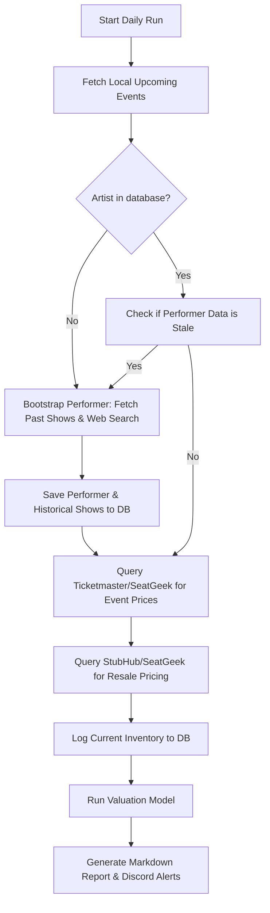

# Design Spec: EDM Ticket Tracker Revamp
**Date:** 2026-07-04
**Status:** Draft / Pending Review

## 1. Overview & Goals
The objective of this revamp is to upgrade the current `edm_ticket_tracker` to make data-driven decisions on upcoming ticket releases. It will evaluate potential resale markup, ticket sales velocity, and historical show performance for EDM performers near the user's configured location.

### Key Requirements
* **Ticketmaster & SeatGeek Integration:** Use Ticketmaster Discovery API for primary prices, face values, and onsale dates, with a graceful fallback to SeatGeek.
* **Database-Backed ETL:** Implement a local SQLite database to store tracked event histories, inventory check logs, and performer statistics.
* **Proactive Lazy-Loading:** Dynamically bootstrap artist history when an upcoming show is announced in the local area.
* **Sales Velocity Tracking:** Log daily ticket inventory counts to detect how quickly a show is selling out.
* **Valuation Model:** Score events based on estimated ROI, historic markups, and sales velocity.
* **Concise Alerts:** Deliver brief Discord notifications with artist, location, ticket price, and estimated resale value (no guessed promo codes).
* **Detailed Reports:** Maintain a markdown valuation report listing detailed historical data reviewed and ROI estimations.

---

## 2. System Architecture & Components
The system is written in Python and is designed with clean boundaries and single-responsibility modules:

```
edm_ticket_tracker/
├── docs/
│   └── reports/
│       └── upcoming_valuation_report.md       # Auto-generated markdown report
│   └── superpowers/
│       └── specs/
│           └── 2026-07-04-edm-ticket-tracker-revamp-design.md # This design spec
├── database.py                                # SQLite schema and queries
├── ticketmaster_client.py                     # Ticketmaster API client (with Mock/Test mode)
├── seatgeek_client.py                         # SeatGeek API client (upcoming/past events)
├── stubhub_scraper.py                         # Secondary market listing price scraper
├── web_scraper.py                             # Google/web search parser for fallback history
├── etl_pipeline.py                            # Coordinates extract, transform, load daily runs
├── valuation_engine.py                        # ROI calculations and priority scoring
├── notifier.py                                # Discord webhook alerts
├── config.py                                  # Loads settings and validation
└── main.py                                    # Orchestrator CLI entrypoint
```

---

## 3. Database Schema
We will create four tables in a local SQLite file (`edm_tracker.db`):

```sql
-- 1. Performers table stores aggregate stats of tracked artists
CREATE TABLE IF NOT EXISTS performers (
    id INTEGER PRIMARY KEY,
    name TEXT NOT NULL,
    popularity_score REAL NOT NULL DEFAULT 0.0,
    avg_past_markup REAL,        -- Average resale markup ratio from past shows
    demand_rating TEXT,          -- Computed rating (e.g., VERY HIGH, HIGH, MEDIUM, LOW)
    last_updated TIMESTAMP DEFAULT CURRENT_TIMESTAMP
);

-- 2. Events table tracks upcoming local shows
CREATE TABLE IF NOT EXISTS events (
    id INTEGER PRIMARY KEY,
    performer_id INTEGER NOT NULL,
    title TEXT NOT NULL,
    venue_name TEXT NOT NULL,
    date TEXT NOT NULL,
    onsale_date TEXT,            -- Tour announcement / ticket release date
    face_value REAL,
    resale_lowest REAL,
    resale_national_avg REAL,
    ticketmaster_url TEXT,
    seatgeek_url TEXT,
    FOREIGN KEY (performer_id) REFERENCES performers(id)
);

-- 3. Inventory logs for calculating sales velocity
CREATE TABLE IF NOT EXISTS inventory_logs (
    id INTEGER PRIMARY KEY AUTOINCREMENT,
    event_id INTEGER NOT NULL,
    check_time TIMESTAMP DEFAULT CURRENT_TIMESTAMP,
    ticket_count INTEGER,        -- Number of listings/tickets left
    lowest_price REAL,
    FOREIGN KEY (event_id) REFERENCES events(id)
);

-- 4. Historical shows database populated by the ETL extraction
CREATE TABLE IF NOT EXISTS historical_shows (
    id INTEGER PRIMARY KEY AUTOINCREMENT,
    performer_id INTEGER NOT NULL,
    venue_name TEXT NOT NULL,
    venue_capacity INTEGER,
    date TEXT NOT NULL,
    face_value REAL,
    peak_resale REAL,
    sell_out_days REAL,          -- Number of days from onsale to sold out
    FOREIGN KEY (performer_id) REFERENCES performers(id)
);
```

---

## 4. The ETL Pipeline & Lazy-Loading Flow
The pipeline runs daily and operates in three distinct stages:



### Proactive Lazy-Loading
1. When a new local show is announced, its artist is cross-referenced with `performers`.
2. If absent or stale (> 7 days old), the system performs historical lookups:
   * Queries Ticketmaster/SeatGeek past events API to collect up to 10 past shows, including venue name, capacity, dates, and original prices.
   * Leverages the `web_scraper` to parse setlists/wiki/news for ticket sellout durations (e.g., "sold out in 5 minutes").
3. Calculates `avg_past_markup` and writes details to `historical_shows`.

---

## 5. Valuation Model & Priority Score
For every upcoming event, the `valuation_engine` computes a **Priority Score** ($S$) ranging from 0 to 100:

$$S = (0.40 \times M) + (0.30 \times V) + (0.30 \times H)$$

### Metrics Defined:
1. **Markup Score ($M$ - 40% weight):**
   * Computes current ROI: $\text{ROI} = \frac{\text{Resale Lowest} - \text{Face Value} - \text{Transaction Fees}}{\text{Face Value}} \times 100$
   * Normalized on a scale of 0 to 100 (where ROI $\ge 150\%$ yields 100).
2. **Sales Velocity Score ($V$ - 30% weight):**
   * Derived from `inventory_logs`. Measures rate of primary ticket exhaustion.
   * If tickets are sold out immediately (or tickets remaining drops by >20% daily), velocity score is high.
3. **Historical Score ($H$ - 30% weight):**
   * Based on average past show markups and speed of selling out (`sell_out_days`).
   * Performers with a history of selling out within 7 days get a score of 100.

### Priorities:
* **Score $\ge 75$:** **CRITICAL** (Extremely high demand, rapid sell-out history, significant ROI potential)
* **Score $50$ to $74$:** **HIGH** (Strong demand, solid resale markup)
* **Score $25$ to $49$:** **MEDIUM** (Modest interest, safe face-value purchasing)
* **Score $< 25$:** **LOW** (Weak secondary market demand, high risk)

---

## 6. Output Formats

### Discord Notification Format (Concise)
* Sent via webhook.
* Strictly reports basic properties and potential resale metrics. No code guessing.
* Example output:
  ```text
  🔥 [CRITICAL] John Summit @ Echostage
  • Location: Echostage (Washington, DC)
  • Est. Price: $45.00
  • Potential Resale Value: $150.00 (Based on 150% historical average markup / 2-day sell-out)
  ```

### Detailed Valuation Report (`docs/reports/upcoming_valuation_report.md`)
An auto-generated markdown report structured as follows:

```markdown
# EDM Ticket Valuation Report - Gaithersburg, MD & Surrounding Area
*Generated on YYYY-MM-DD HH:MM:SS*

## 1. High-Priority Upcoming Opportunities
| Priority | Artist | Venue | Date | Face Value | Resale (Lowest) | Est. ROI | Status |
|---|---|---|---|---|---|---|---|
| 🔴 CRITICAL | Fred again.. | The Anthem | 2026-09-02 | $75.00 | $220.00 | +149% | On Sale |
| 🟡 HIGH | John Summit | Echostage | 2026-08-15 | $45.00 | $125.00 | +136% | Presale Soon |

## 2. Early-Warning (Tour Announcements & Future Releases)
| Artist | Venue | Announcement Date | Onsale Date | Historical Markup | Est. Priority |
|---|---|---|---|---|---|
| Rüfüs Du Sol | Merriweather Post Pavilion | 2026-07-02 | 2026-07-15 | +180% | 🔴 CRITICAL |

## 3. Historical Records Reviewed
### Fred again..
* **Average Past Markup:** +165%
* **Past Shows Reviewed:**
  * 2025-10-12 - Madison Square Garden (Cap: 19,500) - Face: $85.00 | Peak Resale: $250.00 | Sold out in: 0.1 days
  * 2024-06-04 - Shrine Expo Hall (Cap: 5,000) - Face: $60.00 | Peak Resale: $180.00 | Sold out in: 0.2 days

### John Summit
* **Average Past Markup:** +120%
* **Past Shows Reviewed:**
  * 2026-01-20 - Space Miami (Cap: 2,500) - Face: $50.00 | Peak Resale: $135.00 | Sold out in: 2 days
```

---

## 7. Testing & Verification Plan
1. **Mock Mode Execution:** Running `python main.py --test` will trigger simulated runs of Ticketmaster API, SeatGeek, and StubHub, using deterministic inputs to ensure database logs are computed and Discord hooks/reports are properly written.
2. **Error Handling & API Fallbacks:** Validate that if Ticketmaster API returns empty or fails (e.g. rate-limit / invalid credentials), the pipeline switches to SeatGeek and scrapes price points successfully.
3. **Database Population Check:** Run local queries to ensure `inventory_logs` and `historical_shows` records are generated correctly.

---

## 8. Specific Fixes for Known Issues

### 8.1. StubHub Link Stability & Routing
To address broken links in Discord notifications:
1. **Dynamic Venue Cities:** Modify `seatgeek_client.py` and the database schema to parse and store `venue_city` and `venue_state` as discrete fields. Stop using a hardcoded `"Washington DC"` query string. Instead, construct search queries using the event's actual dynamic city (e.g., `Gaithersburg`, `Baltimore`, `Washington`, etc.).
2. **Query Sanitization:** In `stubhub_scraper.py`, sanitize the query string to strip out non-alphanumeric special characters that break URL parsers. For example, convert `"Fred again.."` to `"Fred again"` before encoding.
3. **Secure User Routing:** Update target link generation to route users to the stable consumer search endpoint: `https://www.stubhub.com/secure/search?q={query}` instead of `/find/s/?q=`.

### 8.2. Accurate Ticket Price & Fallback Estimations
To resolve inaccurate ticket pricing reports (e.g., estimating $45 when actual is $81):
1. **Primary Price Source:** Implement full retrieval of primary ticket price ranges (e.g. `$min` and `$max` fields) from the Ticketmaster API. When an event is retrieved from Ticketmaster, use its actual face value rather than an estimate.
2. **Multi-Variable Fallback Heuristic:** Upgrade the fallback estimation function in `resale_checker.py` (`estimate_face_value`). Rather than relying solely on popularity, implement a formula that factors in both the artist's popularity score AND the venue's capacity tier:
   * **Large Venues / Arenas (Capacity > 10,000):** Add a premium to the estimated ticket price (e.g., score > 0.65 $\approx$ $75.00 - $95.00+).
   * **Mid-Sized / Clubs (Capacity <= 3,000):** Use a lower club-tier pricing scale.
   * Calculate a dynamic capacity-adjusted estimate if exact face values are missing.

